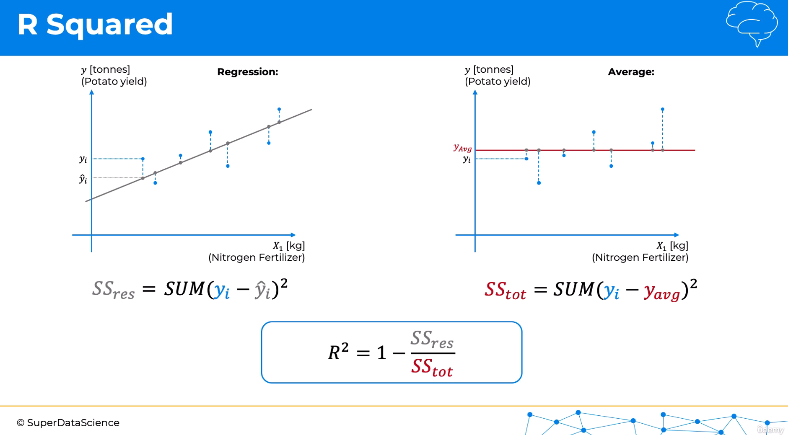

# Evaluation and Selection of Regression Models

- [Evaluation and Selection of Regression Models](#evaluation-and-selection-of-regression-models)
  - [Regression Model Evaluation](#regression-model-evaluation)
    - [R-Squared intuition](#r-squared-intuition)
    - [Adjusted R-Squared intuition](#adjusted-r-squared-intuition)
  - [Regression Model Selection](#regression-model-selection)
    - [Selection based on R²](#selection-based-on-r)
  - [Final Considerations](#final-considerations)
    - [Discussion on R²](#discussion-on-r)
    - [Parameter Tuning and Improvement of Regression Models](#parameter-tuning-and-improvement-of-regression-models)
    - [Regression Pros and Cons](#regression-pros-and-cons)
    - [Overfitting and Regularization](#overfitting-and-regularization)

## Regression Model Evaluation

Regression model evaluation is essential for understanding how well a model fits the data and making decisions about model improvement. One of the primary metrics used is **R-Squared**, which measures the proportion of variance in the dependent variable that is explained by the independent variables. To address the potential pitfalls of R-Squared, especially when adding new variables, **Adjusted R-Squared** provides a more refined metric by accounting for the number of predictors and sample size. Both metrics offer valuable insights into model performance and guide the inclusion of meaningful variables.

### R-Squared intuition

A key metric for evaluating the goodness of fit in regression models It measures how well a regression model fits the data.

To understand it, two plots are compared: one with the regression line and another with an average line.

- In the regression plot, the differences between actual values (yi) and predicted values (ŷi) are summed, which is called the **residual sum of squares**. The residual sum of squares is minimized.
- In the average plot, the differences between the actual values (yi) and the average of all y-values are summed, which is called the **total sum of squares**.
- **R-squared** is calculated as **1 minus the ratio** of the residual sum of squares to the total sum of squares.
- The value of **R-squared** ranges from 0 to 1, with a higher value indicating a better fit. The values really depend on the industry and use case. However, here are some reference values, just for our information:
  - **1** is a perfect fit (almost impossible in practice).
  - Around **0.9** indicates a very good model.
  - Less than **0.7** suggests a mediocre model.
  - Less than **0.4** indicates a poor model.
  - Negative values mean the model doesn’t make sense for the data.

### Adjusted R-Squared intuition

A common issue in regression analysis: When adding new independent variables to a linear regression model:
- The **total sum of squares (SStot)** remains unchanged
- But the **residual sum of squares (SSres)** either decreases or stays the same:
  - If a new variable improves predictions, the SSres decreases, even if the improvement is small. 
  - If it doesn't improve predictions, the Ordinary Least Squares (OLS) sets the new variable's coefficient to zero, so the SSres remains unchanged.
  - This happens because the OLS method always tries to minimize the SSres.
- This can lead to a false increase in **R-squared** just by adding irrelevant variables, which is problematic because R-squared never decreases, even if the new variables don’t add meaningful value.

 **Adjusted R-squared** is a solution for this:

 

- **Adjusted R-squared** addresses this by penalizing the addition of variables that don’t improve the model enough. 
- It includes the **number of independent variables (k)** and the **sample size (n)**, reducing the Adjusted R-squared when unnecessary variables are added.
- The new variable is only worth adding if it improves the model significantly, ensuring only valuable variables are included.

Adjusted R-squared ensures that adding variables is justified by a substantial improvement in the model.

## Regression Model Selection

### Selection based on R²

In this section, we will explore how to evaluate and select the best regression model for your data. The methodology is as follows: 

1. **Try All Regression Models**: Implement each of the regression models studied.
2. **Evaluate Performance**: Assess each model’s performance using metrics such as R-squared or adjusted R-squared.
3. **Select the Best Model**: Choose the model that demonstrates the best performance based on these metrics.

For this, the course gives us some [templates](Template/), and we also have the [example folder](Example/) to run multiple regression models on a dataset using code templates. The [dataset](Example/Data.csv) used has four features —ambient temperature, vacuum, ambient pressure, and humidity— and predicts energy output.

The goal is to determine which model performs best by evaluating the R-squared coefficient. 

We tested the dataset with all the models and these are the results obtained:

| **Model**                  | **R-Squared (R²)**       |
|----------------------------|--------------------------|
| Multiple Linear Regression  | 0.9325                   |
| Polynomial Regression       | 0.9458                   |
| Support Vector Regression   | 0.9481                   |
| Decision Tree Regression    | 0.9229                   |
| Random Forest Regression    | 0.9616                   |

After testing the dataset with various regression models, we obtained the following R-squared values for each model:

- **Multiple Linear Regression**: 0.9325
- **Polynomial Regression**: 0.9458
- **Support Vector Regression**: 0.9481
- **Decision Tree Regression**: 0.9229
- **Random Forest Regression**: 0.9616

Conclusion:
1. **Random Forest Regression** achieved the highest R-squared value (0.9616), indicating the best predictive performance among all models. It demonstrates the model's ability to capture the relationship between the features and the target variable effectively.
   
2. **Support Vector Regression** and **Polynomial Regression** also performed well, with R-squared values close to 0.95. These models show strong accuracy, though slightly lower than Random Forest.

3. **Multiple Linear Regression** provided a good performance (0.9325), but it is outperformed by more complex models like Polynomial Regression and Support Vector Regression.

4. **Decision Tree Regression** had the lowest R-squared value (0.9229), making it the least effective model for this dataset.

In conclusion, **Random Forest Regression** stands out as the best model for this dataset, followed closely by **Support Vector Regression** and **Polynomial Regression**.

## Final Considerations

### Discussion on R²
While the R² value is a helpful metric to assess model performance, it should not be the sole criterion for selecting a model. You should also evaluate the model based on generalization (e.g., cross-validation), complexity, interpretability, and computational cost.

Here are some important considerations:

1. **Overfitting**: Models with a high R² value, such as **Random Forest** or **Polynomial Regression**, may fit the training data very well but could overfit the data, leading to poor generalization on new or unseen data. You should test the model’s performance on a separate validation or test dataset to ensure it generalizes well.

2. **Model Complexity**: More complex models like **Random Forest** or **Support Vector Regression** often require more computational resources and time to train and predict compared to simpler models like **Multiple Linear Regression**. If your goal is efficiency or if you’re working with a smaller dataset, a simpler model might be preferable despite a slightly lower R² value.

3. **Interpretability**: Some models, such as **Multiple Linear Regression**, are more interpretable and easier to explain, especially when you need to understand the relationship between the variables. In contrast, **Random Forest** or **Support Vector Regression** are often seen as "black boxes," which might not be ideal if interpretability is crucial.

4. **Data Size and Features**: The size of your dataset and the number of features can also influence your choice. For example, **Decision Trees** and **Random Forests** work well with larger datasets and complex feature interactions, while simpler models might perform similarly on smaller datasets.

### Parameter Tuning and Improvement of Regression Models

Each model has two types of parameters:
1. **Learned parameters**: These are the values that the model learns from the data, like the coefficients in a Linear Regression model.
2. **Hyperparameters**: These are fixed values that influence how the model works but are not learned from the data. Examples include the regularization parameter (λ) or the inverse regularization parameter (C).

Up until now, default values for these hyperparameters have been used, but by tuning them, you can optimize the model’s performance. **Parameter Tuning** is the process of finding the optimal hyperparameter values to boost the model's accuracy and efficiency. 

Later in the course we will see how to configure these parameters to maximize the performance of the model.

### Regression Pros and Cons

To help the decision-making process, the below table highlights the strengths and weaknesses of each regression model.

| **Regression Model**          | **Pros**                                                                 | **Cons**                                                                              |
|-------------------------------|--------------------------------------------------------------------------|---------------------------------------------------------------------------------------|
| **Linear Regression**          | Works on any size of dataset, provides information about feature relevance | Must meet the assumptions of linear regression                                         |
| **Polynomial Regression**      | Works on any size of dataset, effective for non-linear problems           | Need to choose the correct polynomial degree for good bias/variance tradeoff           |
| **Support Vector Regression**  | Easily adaptable, works well on non-linear problems, not biased by outliers | Requires feature scaling, more difficult to understand, less well-known                |
| **Decision Tree Regression**   | High interpretability, no need for feature scaling, handles both linear and non-linear problems | Poor performance on small datasets, prone to overfitting                               |
| **Random Forest Regression**   | Powerful, accurate, performs well on many problems including non-linear    | Lacks interpretability, prone to overfitting, requires choosing the number of trees      |

### Overfitting and Regularization

**Problem of Overfitting**:Overfitting occurs when a model learns not only the underlying pattern in the training data but also the noise or irrelevant details. This results in a model that performs well on the training data but poorly on new, unseen data (i.e., it generalizes poorly). Overfitting is more likely when the model is too complex relative to the data.

**Regularization as a Solution**: Regularization helps address overfitting by introducing a penalty for overly complex models. This penalty constrains the model's learned parameters, encouraging simpler models that generalize better.

**Types of Regularization**
1. **Ridge Regression (L2 Regularization)**: 
   - Adds a penalty term proportional to the square of the coefficients (L2 norm). 
   - Helps reduce the magnitude of the coefficients, making the model less sensitive to fluctuations in the data.
   
2. **Lasso Regression (L1 Regularization)**:
   - Adds a penalty proportional to the absolute value of the coefficients (L1 norm).
   - Can reduce some coefficients to exactly zero, performing feature selection by excluding irrelevant features from the model.

3. **Elastic Net**:
   - Combines both L1 (Lasso) and L2 (Ridge) regularization.
   - Balances between Ridge’s shrinkage of all coefficients and Lasso’s ability to select important features, offering flexibility for different types of data.

Each method helps prevent overfitting by controlling model complexity, improving generalization to new data. Please check [Regularization Intuition PDF](Regularization_Intuition.pdf) for more information.