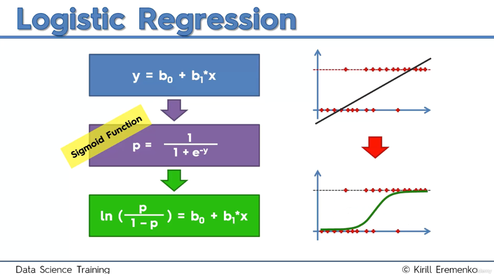

# Logistic Regression Intuition

## Introduction

In this section, we delve into the fundamental concepts of **logistic regression**. Logistic regression is a crucial statistical method that allows us to predict binary outcomes based on one or more independent variables. 

## Overview

**Linear Regression Review**
- Linear regression is a foundational statistical technique used to model the relationship between independent and dependent variables.
- In the case of simple linear regression, we derive a straightforward formula to fit a line through our data.
- Multiple linear regression extends this concept by incorporating multiple independent variables.

**Logistic Regression Application Context**
 - Consider a scenario where a company sends email offers to customers to encourage purchases. We analyze customer data, including their age and whether they took action (e.g., made a purchase).
 - The challenge is to model the relationship between customer age and the likelihood of taking action.

On the image below, we can see an example of the linear regression represented on the right graph, and the new scenario for logistic regression represented on the left side:

**Initial Thoughts**
   - A scatter plot reveals a potential correlation: older customers are more likely to respond to offers, while younger customers may ignore them.
   - Attempting to apply linear regression to this scenario yields unsatisfactory results because predictions extend beyond the binary outcome (0 or 1).

## Transitioning to Logistic Regression

1. **Defining the Problem**
   - Instead of predicting a definite outcome, logistic regression allows us to estimate the **probability** of a customer taking action based on their age.
   - The probabilities are constrained between 0 and 1, aligning with the nature of binary outcomes.

2. **Modeling the Relationship**
   - The goal is to fit a curve that represents the probability of taking action, rather than a linear line.
   - Logistic regression replaces the linear regression line with a curve that is confined between the limits of 0 and 1.

3. **The Sigmoid Function**
   - By applying the **sigmoid function** to our linear regression formula, we obtain the logistic regression model. The sigmoid function maps any input to a value between 0 and 1, providing a more accurate representation of probabilities.

## Key Components of Logistic Regression

1. **Modeling Probabilities (p̂)**
   - We can utilize logistic regression to predict the probability of a customer taking action based on their age.
   - For example, a 20-year-old may have a 0.7% chance, while a 50-year-old may have a 99.4% chance of responding positively to an offer.

2. **Predicted Values (ŷ, e.g. "Yes" or "No")**
   - Beyond probabilities, we can derive predicted values (ŷ) by selecting a cutoff point, typically 50%. 
   - If the predicted probability exceeds this threshold, we classify the outcome as 1 (action taken); otherwise, it’s classified as 0 (no action taken).

## Conclusion

Logistic regression serves as a powerful tool for predicting binary outcomes based on independent variables. 
- Logistic regression provides insights into the likelihood of an event occurring based on various factors, such as age.
- This model allows for ranking individuals based on their predicted probabilities, enhancing decision-making for targeted marketing strategies.

By understanding the underlying intuition and methodology, we can leverage this technique to make informed decisions in various applications, including marketing and customer segmentation. Emphasizing the transition from linear regression to logistic regression helps clarify the importance of modeling probabilities in binary classification problems.

