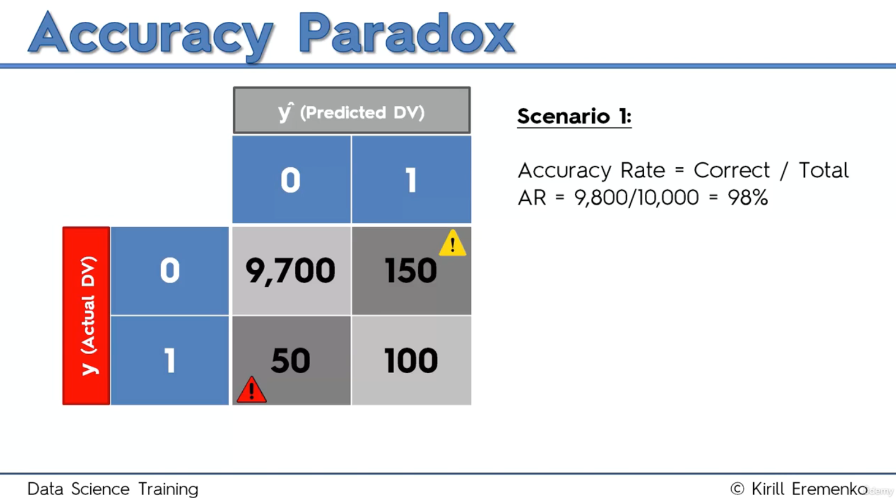
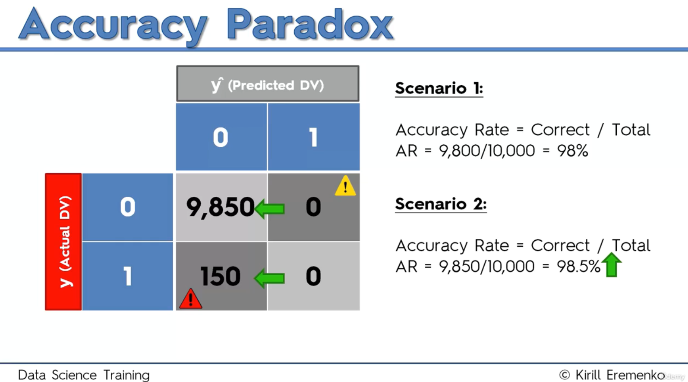
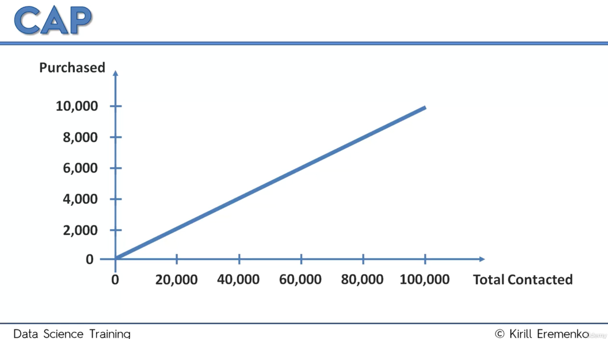
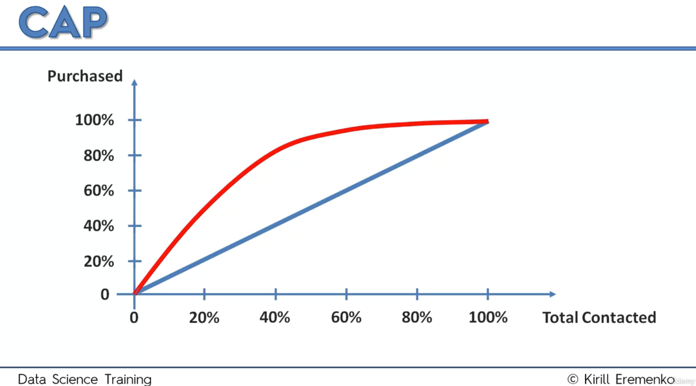
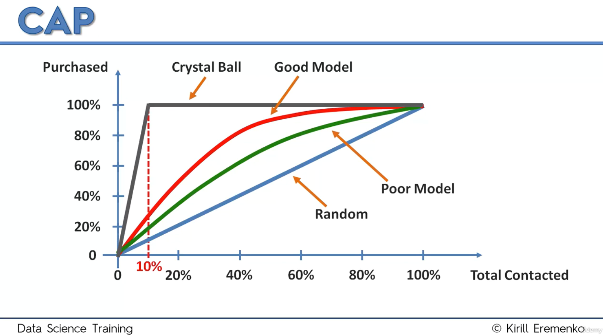
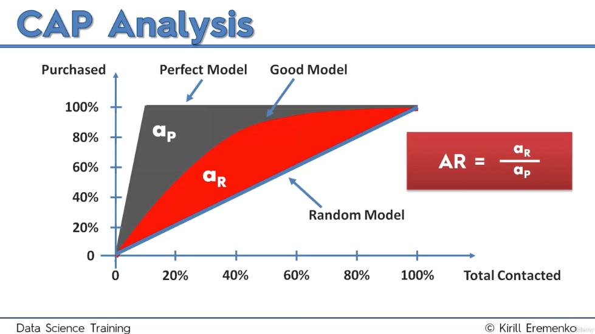
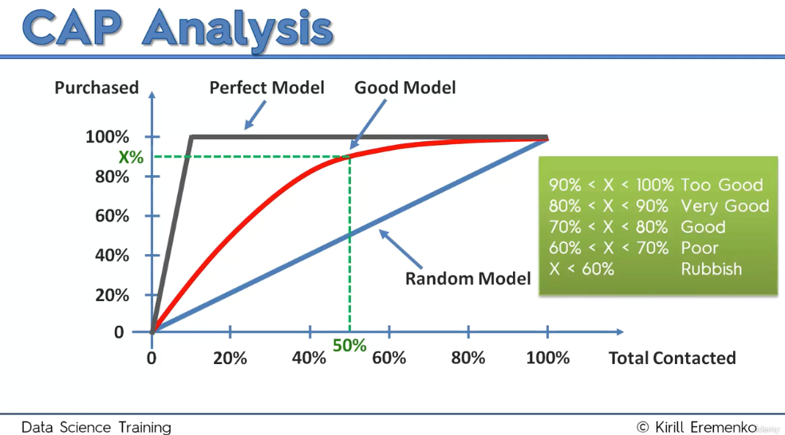

# Evaluation and Selection of Classification Models

- [Evaluation and Selection of Classification Models](#evaluation-and-selection-of-classification-models)
  - [Confusion Matrix](#confusion-matrix)
    - [Accuracy Rate](#accuracy-rate)
    - [Error Rate](#error-rate)
  - [Classification Model Selection based on Confusion Matrix](#classification-model-selection-based-on-confusion-matrix)
  - [Final Considerations](#final-considerations)
    - [Accuracy Paradox](#accuracy-paradox)
    - [Cumulative Accuracy Profile (CAP)](#cumulative-accuracy-profile-cap)
    - [Classification Pros and Cons](#classification-pros-and-cons)
    - [How do I know which model to choose for my problem?](#how-do-i-know-which-model-to-choose-for-my-problem)
    - [How can I improve each of these models?](#how-can-i-improve-each-of-these-models)

## Confusion Matrix

A confusion matrix is a table used to evaluate the performance of a classification model by comparing its predictions with actual outcomes. For example, to predict lung cancer from x-ray images, the matrix consists of four categories:

1. **True Negative (TN)**: The model predicts "no cancer", and in reality, the person doesn't have cancer. This is a correct prediction.
2. **True Positive (TP)**: The model predicts "cancer", and in reality, the person does have cancer. Another correct prediction.
3. **False Positive (FP)**: The model predicts "cancer", but the person does not actually have cancer. This is a wrong prediction, also known as a **Type I error**.
4. **False Negative (FN)**: The model predicts "no cancer", but the person does have cancer. This is another wrong prediction, known as a **Type II error** and potentially more dangerous because the cancer could go untreated.

It’s helpful to remember that a **false positive (Type 1)** is less harmful in some contexts, such as predicting an earthquake that doesn’t occur. A **false negative (Type 2)**, however, can be more serious, as it involves predicting that something will not happen (e.g., no earthquake), but it does occur, leaving no time to prepare. Both types of errors are essential to track when assessing the performance of a model.

### Accuracy Rate
Accuracy measures how well the model performed by calculating the proportion of correct predictions (true positives and true negatives) out of the total number of predictions.

$$
\text{Accuracy} = \frac{TN + TP}{\text{Total Predictions}}
$$

### Error Rate
The error rate is the proportion of incorrect predictions (false positives and false negatives) out of the total predictions:

$$
\text{Error Rate} = \frac{FP + FN}{\text{Total Predictions}}
$$

## Classification Model Selection based on Confusion Matrix

In this section, we will explore how to evaluate and select the best classification model for your data. The methodology is as follows: 

1. **Try All Classification Models**: Implement each of the classification models studied.
2. **Evaluate Performance**: Assess each model’s performance using metrics such as Accuracy Score.
3. **Select the Best Model**: Choose the model that demonstrates the best performance based on these metrics.

For this, the course gives us some [templates](Template/), and we also have the [example folder](Example/) to run multiple classification models on a dataset using code templates. The [dataset](Example/Data.csv) is about the breast cancer from the UCI Machine Learning Repository, where the goal is to predict whether a tumor is benign (value 2) or malignant (value 4) based on several medical features (e.g., clump thickness, cell size uniformity).

These templates can handle any dataset, regardless of the number of features, as long as preprocessing like one-hot encoding (for categorical variables) is applied beforehand.

The goal is to determine which model performs best by evaluating the Accuracy Score. We tested the dataset with all the models and these are the results obtained:

| Model                       | Accuracy Score          |
|-----------------------------|-------------------------|
| Logistic Regression          | 0.9474      |
| K-NN                         | 0.9474      |
| Support Vector Machine       | 0.9415      |
| Kernel SVM                   | 0.9532      |
| Naive Bayes                  | 0.9415      |
| Decision Tree Classification | 0.9591      |
| Random Forest Classification | 0.9357       |

Conclusion:

The results of each model are as follows:
- **Logistic Regression and K-Nearest Neighbors (K-NN)** both achieved an accuracy of approximately 95%.
- **Support Vector Machine (SVM)** had a slightly lower accuracy of 94%.
- **Kernel SVM** outperformed these with an accuracy of 95.3%.
- **Naive Bayes** yielded the same accuracy as SVM at 94%.
- **Decision Tree Classification** surprisingly achieved the highest accuracy of 95.9%, which was unexpected based on typical performance, surpassing the others.
- **Random Forest Classification**, which usually works well in team-based approaches, performed poorly. This highlights the importance of trying different models in the selection process, as there is no universal best model. 

The key conclusion from this analysis is that **Decision Tree Classification** performed best with an accuracy of 95.9%, surpassing expectations and outpacing models typically considered more robust, such as Random Forest Classification. 

This demonstrates the importance of testing multiple models, as model performance can vary depending on the dataset. No model universally guarantees the best results, and it's essential to evaluate each using metrics like accuracy to identify the optimal choice. The methodology also shows that even simple models like Logistic Regression and K-NN can achieve competitive results close to more complex models.

## Final Considerations

### Accuracy Paradox
In this example, a confusion matrix for a model with 10,000 records shows that the model made 150 Type 1 errors (false positives) and 50 Type 2 errors (false negatives), while predicting most cases correctly. The initial accuracy rate is calculated as 98%, based on 9,800 correct predictions out of 10,000. 

If the model completely stops making predictions and always predicts "no event", in this scenario, the confusion matrix changes, and the accuracy rate increases slightly to 98.5%, despite the model no longer making meaningful predictions. 

This illustrates the **accuracy paradox**, where a higher accuracy rate does not necessarily mean a better model, as the accuracy can be misleading if used as the sole metric for model evaluation. **Accuracy alone should not be used for judgment**. Let's introduce the cumulative accuracy profile (CAP) as a better evaluation method.

### Cumulative Accuracy Profile (CAP)
The **Cumulative Accuracy Profile (CAP)** is a method used to assess the performance of predictive models, offering a more robust alternative to accuracy-based metrics. 

In the example provided, imagine a store that sends promotional emails to customers. Historically, 10% of customers respond to these emails. This is represented as 100,000 customers on the horizontal axis and 10,000 responses on the vertical axis. If emails are sent to a random 20,000 customers, about 2,000 responses are expected. A straight line represents this random selection scenario, where the response rate remains steady at 10%.

The idea behind the CAP curve is to improve targeting. By using a predictive model that ranks customers based on the likelihood of responding, the store can prioritize those most likely to purchase. A good model will allow the store to contact fewer customers and still achieve a higher response rate, reaching close to the total 10,000 responders before contacting the full customer base. For example, the model might predict 9,500 responses by targeting only 60,000 customers instead of all 100,000.

The CAP curve is drawn by comparing the actual responses based on the model's predictions.
- A **random selection** process is represented by a diagonal blue line, 
- while a **good model** is represented by a curve that rises sharply before flattening out, indicating better targeting.
- The **area between the model’s curve and the random line** is the key metric; a larger area means a better model. If the model were perfect, it would predict all purchases at the start, creating an "ideal" line that quickly rises to 100% responders.

By plotting CAP curves for different models, it's possible to compare their performance.
- A **poor model** (closer to the blue line) still performs better than random, but is less effective than a **good model** (farther from the blue line).
- If a model’s curve falls below the random line, it indicates a **bad model** that is worse than random guessing.
- Finally, the gray line represents a **perfect model or cristall ball** that predicts all positive outcomes immediately.

> It's important to differentiate CAP from similar curves like the **ROC (Receiver Operating Characteristic) curve**, as both are commonly confused. The CAP focuses on cumulative responses and is used for assessing models with ranked outputs, while ROC curves are used in binary classification contexts.

To analyze CAP curves, two methods are used:

1. **Accuracy Ratio (AR)**: The AR is calculated by dividing the area under the model's curve (red) by the area under the perfect model's curve (gray). An AR closer to 1 indicates a better model, while a value near 0 suggests poor performance. However, calculating these areas can be complex.

2. **50% Rule**: Instead of calculating areas, look at where the model intersects the 50% point on the horizontal axis and see how many positive outcomes are captured (on the vertical axis). Based on this, the model is assessed:
   - **Less than 60%**: Poor model.
   - **60%-70%**: Average or poor model.
   - **70%-80%**: Good model.
   - **80%-90%**: Very good model.
   - **90%-100%**: Excellent, but may indicate overfitting or the use of future data.

Careful consideration is needed for models with extremely high accuracy, as they might be overfitting or using post-facto variables. Overfitting occurs when the model fits the training data too closely, leading to poor performance on new data.

### Classification Pros and Cons
Find below a table with the pros and the cons of each classification model.

| **Classification Model**         | **Pros**                                                                                     | **Cons**                                                                                             |
|----------------------------------|---------------------------------------------------------------------------------------------|-----------------------------------------------------------------------------------------------------|
| **Logistic Regression**          | Probabilistic approach, gives information about statistical significance of features         | The Logistic Regression Assumptions                                                                  |
| **K-NN (K-Nearest Neighbors)**   | Simple to understand, fast and efficient                                                     | Need to choose the number of neighbors (k)                                                           |
| **SVM (Support Vector Machine)** | Performant, not biased by outliers, not sensitive to overfitting                             | Not appropriate for non-linear problems, not the best choice for a large number of features           |
| **Kernel SVM**                   | High performance on nonlinear problems, not biased by outliers, not sensitive to overfitting | Not the best choice for a large number of features, more complex                                     |
| **Naive Bayes**                  | Efficient, not biased by outliers, works on nonlinear problems, probabilistic approach        | Based on the assumption that features have the same statistical relevance                            |
| **Decision Tree Classification** | Interpretability, no need for feature scaling, works on both linear and nonlinear problems   | Poor results on too small datasets, overfitting can easily occur                                     |
| **Random Forest Classification** | Powerful and accurate, good performance on many problems, including nonlinear problems       | No interpretability, overfitting can easily occur, need to choose the number of trees                |

### How do I know which model to choose for my problem?

1. Figure out whether your problem is linear or non linear.
   1. If your problem is linear, you should go for Logistic Regression or SVM.
   2. If your problem is non linear, you should go for K-NN, Naive Bayes, Decision Tree or Random Forest.
2. Then which one should you choose in each case? You will learn that in Part 10 - Model Selection with k-Fold Cross Validation.

From a business point of view, you would rather use:

- **Logistic Regression** or **Naive Bayes** when you want to rank your predictions by their probability. 
  - For example if you want to rank your customers from the highest probability that they buy a certain product, to the lowest probability. Eventually that allows you to target your marketing campaigns. And of course for this type of business problem, you should use Logistic Regression if your problem is linear, and Naive Bayes if your problem is non linear.

- **SVM** when you want to predict to which segment your customers belong to. 
  - Segments can be any kind of segments, for example some market segments you identified earlier with clustering.

- **Decision Tree** when you want to have clear interpretation of your model results,

- **Random Forest** when you are just looking for high performance with less need for interpretation. 

### How can I improve each of these models?
In Part 10 - Model Selection, you will find the second section dedicated to Parameter Tuning, that will allow you to improve the performance of your models, by tuning them. You probably already noticed that each model is composed of two types of parameters:
- the parameters that are learnt, for example the coefficients in Linear Regression,
- the hyperparameters.

The hyperparameters are the parameters that are not learnt and that are fixed values inside the model equations. For example, the regularization parameter lambda or the penalty parameter C are hyperparameters. So far we used the default value of these hyperparameters, and we haven't searched for their optimal value so that your model reaches even higher performance. Finding their optimal value is exactly what Parameter Tuning is about. So for those of you already interested in improving your model performance and doing some parameter tuning, feel free to jump directly to Part 10 - Model Selection.
