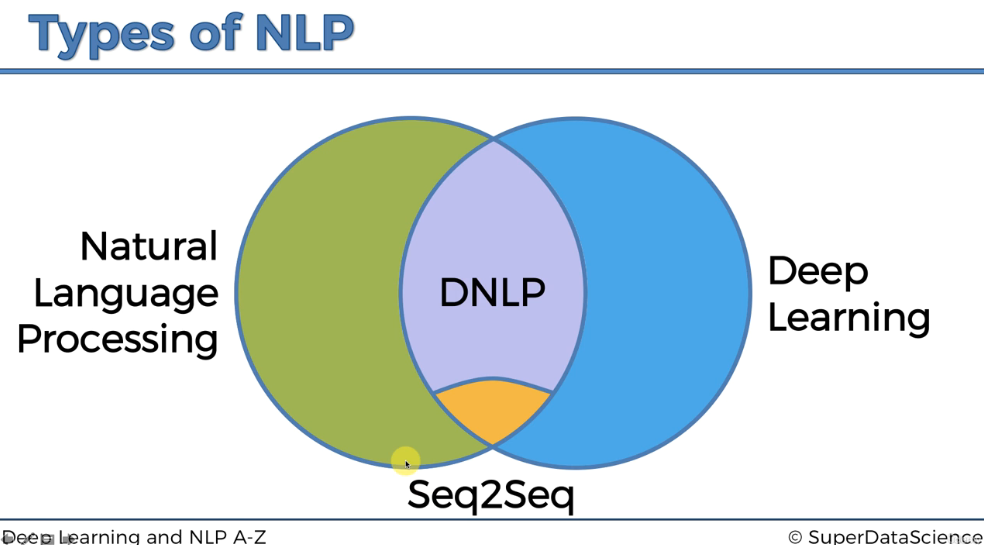

# Natural Language Processing (NLP)

**Natural Language Processing (NLP)** is a subfield of Machine Learning that focuses on enabling machines to understand, interpret, and generate human language. NLP algorithms process spoken and written language, allowing machines to analyze text, recognize speech, translate between languages, and even predict sentiment. If you've ever used a voice assistant or seen text automatically converted from speech on your smartphone, you've experienced NLP in action.

We will explore how NLP models can be applied to a wide range of tasks, such as predicting the sentiment of a review, classifying news articles by category, or even recognizing the genre of a book. 

## History: from traditional NLP models to deep learning-based approaches

The comparison highlights how NLP has evolved from basic rule-based methods to advanced neural network-driven models, making it more dynamic, adaptive, and capable of tackling sophisticated tasks like language generation and translation.

1. **Traditional NLP models**: include:
   - **If/else rules**: Used in early chatbots, they rely on predefined responses, which are rigid and limited.
   - **Audio Frequency Analysis**: Used in early speech recognition without deep learning, analyzing sound wave frequencies to identify speech. It’s purely mathematical and less adaptable than neural networks.
   - **Bag of Words**: This model converts text into a "bag" of words, counting word frequency to classify text. It's effective for sentiment analysis and text classification but ignores word order and context.
   - **Naive Bayes Classifier**: A simple probabilistic classifier often used for tasks like spam detection or sentiment analysis.

2. **Deep learning models in NLP (DNLP)**: combines traditional NLP with neural network (deep learning) models.
   - **Deep Learning: Convolutional Neural Networks (CNNs)**: Originally designed for image processing, CNNs are adapted to text recognition by embedding words into matrices and applying convolution operations. While innovative, CNNs in NLP were eventually surpassed by more advanced models.
   - Examples of **DNLP**:
     - **Word2Vec**: A deep learning model that transforms words into vector representations (embeddings), capturing their semantic relationships.
     - **BERT (Bidirectional Encoder Representations from Transformers)**: A powerful deep learning model used for understanding the context of a word in all directions, applied in tasks like question answering or sentiment analysis. 

3. **Sequence-to-sequence models (Seq2Seq)**: These models represent the cutting-edge in NLP, such as those used for machine translation, speech recognition and other advanced tasks. These models use an encoder-decoder architecture to process input sequences and generate output sequences, revolutionizing complex language tasks.
     - **Neural Machine Translation (NMT)**: Translates text from one language to another using models like the Transformer.
     - **Image Captioning**: Generates descriptive text for images by using CNNs to encode images and RNNs to produce sentences.
     - **Speech Recognition**: Converts spoken language into text using models like Long Short-Term Memory (LSTM) networks or Transformer-based architectures like Wav2Vec.
     - **Chatbots**: Utilize sequence-to-sequence models to understand and generate conversational responses. E.g. OpenAI’s GPT

> **Deep learning algorithms**: Non-NLP algorithms. These are based on neural networks and can be applied to various tasks, not limited to NLP. E.g. Convolutional Neural Networks (CNNs) used for image classification, Recurrent Neural Networks (RNNs) used to handle sequential data like time series prediction, etc.

## Our Focus

The emphasis of this section will be on classical NLP models, particularly the **Bag of Words model**, implementing it in the practical tutorials. Advanced topics such as deep learning and sequence-to-sequence (SEC-to-SEC) models are not the focus of this section. Instead, the goal is to provide foundational knowledge and practical skills for analyzing text data. For advanced topics, refer to the specialized course on *Deep Learning and NLP A to Z* if needed.

By the end of this section, we will:
1. **Clean and preprocess text data**: Cleaning and preparing raw text data for analysis by removing noise (e.g., punctuation, stop words), tokenizing sentences, and normalizing text.
2. Build a **Bag of Words model**: A method of converting text into a numerical representation by counting word occurrences, which can be used as input for classification algorithms.
3. Apply Machine Learning **Classification Algorithms** onto this Bag of Worlds model to solve NLP problems.
    - **Classification Algorithms**: Classification models such as Logistic Regression, Naive Bayes, CART (Decision Trees), and Hidden Markov Models, are algorithms that classify text data into categories based on patterns in the words. They are commonly used for tasks like sentiment analysis, language classification, and text categorization.

## Use Cases

NLP is widely applied across different industries, enabling powerful text and language analysis:

- **Sentiment Analysis**: Predict whether a review is positive or negative based on the words used in the text.
- **Text Classification**: Categorize articles or documents into predefined topics (e.g., sports, politics, technology) using NLP techniques.
- **Machine Translation**: Build systems that automatically translate text from one language to another.
- **Speech Recognition**: Convert spoken language into text using classification models to understand speech patterns and context.

