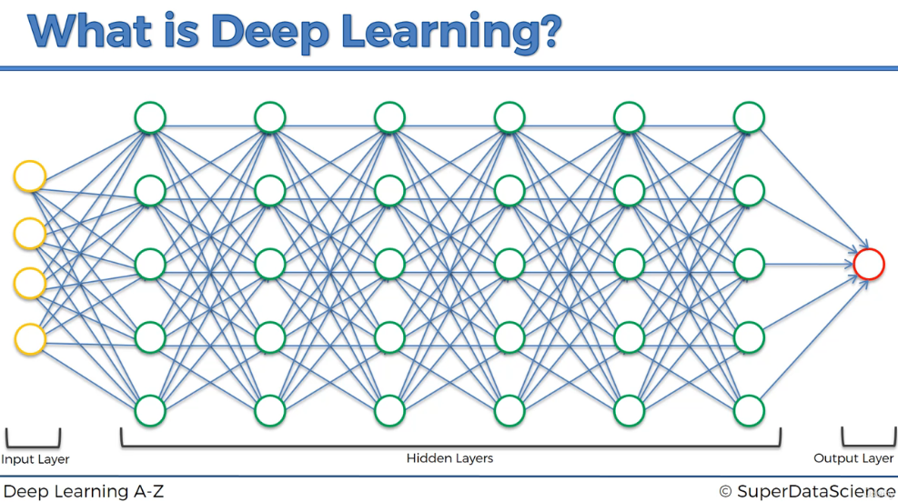

# Deep Learning

## History of Deep Learning

Deep learning, including neural networks, has existed since the 1960s and 1970s. However, it only gained significant momentum in recent years due to advancements in technology. In the 1980s, deep learning drew some attention but gradually faded in the following decade. The issue wasn’t the technology itself but rather the limitations in computing power and data storage at the time.

Today, deep learning has experienced a resurgence, driven by exponential improvements in data availability and processing power. For instance, storage capacities have soared, from a 5MB hard drive in 1956 to modern SSDs with hundreds of gigabytes. Similarly, computing power has grown exponentially, in line with Moore's Law.

## What is Deep Learning

These advances make it possible to train complex neural networks that mimic the human brain, which has around 100 billion neurons connected to thousands of others. Deep learning models simulate this structure by using multiple layers of "neurons" to process input data, passing it through hidden layers before generating predictions. When multiple hidden layers are involved, it's called "deep learning," allowing models to handle highly complex tasks.

The field is now progressing rapidly, and deep learning is poised to make a major impact in various industries.

## Use Cases

Deep learning models can be applied to a wide range of complex tasks, including:

1. **Artificial Neural Networks** for regression and classification
2. **Convolutional Neural Networks** for computer vision
3. **Recurrent Neural Networks** for time series analysis
4. **Self-Organizing Maps** for feature extraction
5. **Deep Boltzmann Machines** for recommendation systems
6. **Autoencoders** for recommendation systems

## Our focus

In this section, we will explore and implement the following deep learning models:

1. **Artificial Neural Networks** to solve a business problem
2. **Convolutional Neural Networks** for a computer vision task

